# 🏭 Centralized Recipe Manager SCADA
### Factory I/O · TIA Portal S7-1500 · Modbus TCP · Ignition Perspective
<p align="center">
  
  
  
  
  
  
</p>
> A fully operational industrial recipe management system built on a simulated S7-1500 PLC, controlling a live Factory I/O filling & packaging line through a professional Ignition SCADA dashboard — with bidirectional Modbus TCP communication and real-time recipe switching.

---

## 📽️ Demo Video

> **[▶ Watch Full Demo on YouTube]((https://youtu.be/MIh4xIncnIs))**

*Select Oil 1L → hit Activate → watch the belt slow from 60% to 25% in real time while both processing stations adjust their hold times. The product counter updates live on the dashboard.*

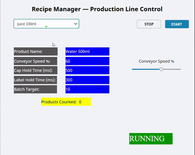

---

## 🗺️ System Architecture


```
┌─────────────────┐     S7-PLCSIM     ┌──────────────────────────┐
│   Factory I/O   │◄─────Advanced────►│     TIA Portal V18       │
│  Filling Line   │                   │   CPU 1511-1 PN (Sim)    │
│                 │                   │                          │
│ • Belt Conveyor │                   │  ┌──────────────────┐    │
│ • Cap Station   │                   │  │   Recipe_DB (DB1)│    │
│ • Label Station │                   │  │  Array[0..9] of  │    │
│ • 2x Sensors    │                   │  │  Recipe_Type UDT │    │
│ • Remover       │                   │  └──────────────────┘    │
└─────────────────┘                   │  ┌──────────────────┐    │
                                      │  │  Control_DB (DB2)│    │
                                      │  │  MB_SERVER Block │    │
                                      │  │  Recipe_Control  │    │
                                      │  │  FB (SCL)        │    │
                                      │  └──────────────────┘    │
                                      └────────────┬─────────────┘
                                                   │
                                              Modbus TCP
                                              Port 502
                                                   │
                                      ┌────────────▼─────────────┐
                                      │   Ignition Maker 8.3.4   │
                                      │   Perspective Dashboard  │
                                      │                          │
                                      │ • Recipe Dropdown        │
                                      │ • Speed Slider           │
                                      │ • Live Parameter Display │
                                      │ • Product Counter        │
                                      │ • Batch Target Monitor   │
                                      └──────────────────────────┘
```

---

## ⚡ What This Project Demonstrates

| Skill | Implementation |
|---|---|
| **PLC Data Architecture** | UDT-based recipe array (10 slots), non-optimized DB, SCL FB with 5-state machine |
| **Industrial Communication** | Modbus TCP via MB_SERVER — bidirectional read/write from SCADA |
| **SCADA Development** | Ignition Perspective — live tag binding, event scripting, expression-based UI |
| **Simulation Realism** | Factory I/O closed-loop — recipe change causes immediate physical response |
| **Professional PLC Coding** | Structured Text state machines with timer-based sequencing |

---

## 🖥️ Dashboard

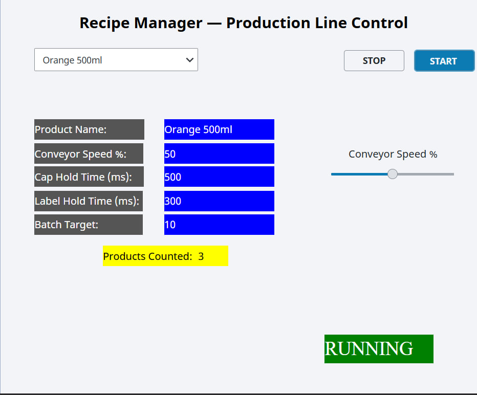

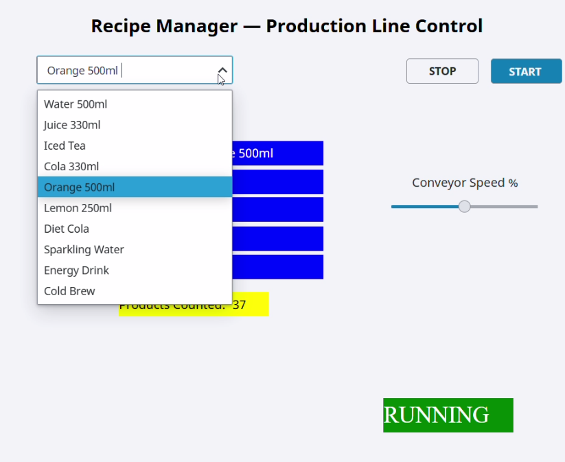

---

## 🏗️ Factory I/O Scene

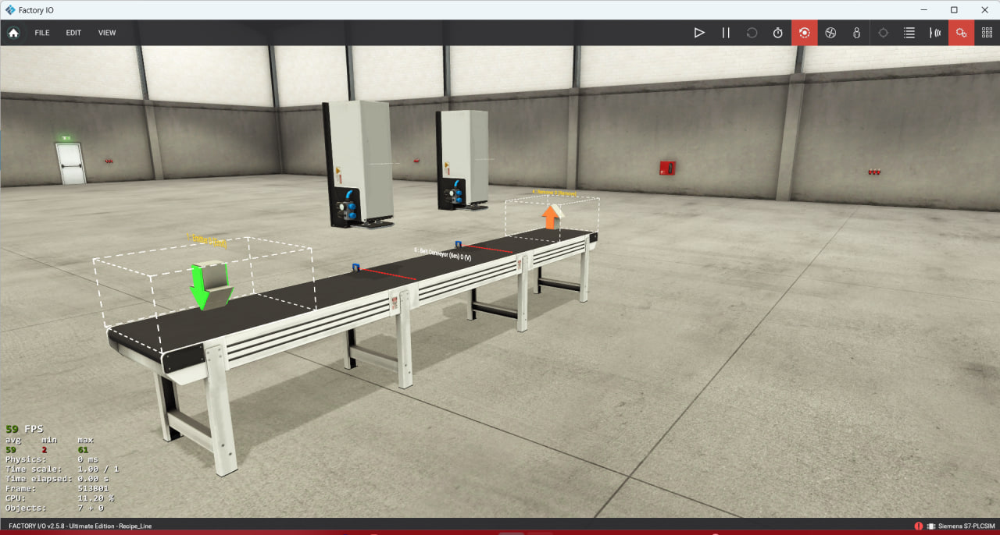

---

## 🔄 Live Pusher Cycle


---

## 📈 Product Counter Live

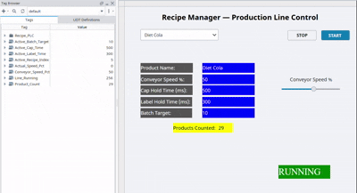

---

## 🛠️ Technology Stack

| Layer | Technology | Version |
|---|---|---|
| PLC Simulation | PLCSIM Advanced | V7.0 |
| PLC Programming | TIA Portal | V18 Update 5 |
| Factory Simulation | Factory I/O | 2.5.8 |
| SCADA | Ignition Maker Edition | 8.3.4 |
| Communication | Modbus TCP (MB_SERVER) | Port 502 |
| PLC Language | SCL (Structured Text) | — |

---

## 🏗️ Project Structure

```
recipe-manager-scada/
├── tia_portal/
│   ├── RecipeManager.ap18          # TIA Portal project export
│   └── Recipe_Control_FB.scl       # SCL function block source
├── ignition/
│   └── RecipeManager_export.zip    # Ignition project export
├── factory_io/
│   └── Recipe_Line.factoryio       # Factory I/O scene file
├── docs/
│   ├── modbus_register_map.md      # Complete Modbus register table
│   └── udt_data_model.md           # Recipe_Type UDT documentation
├── assets/
│   ├── screenshots/                # Dashboard and TIA Portal screenshots
│   └── gifs/                       # Demo GIFs
└── README.md
```

---

## 📋 Recipe Data Model

### Recipe_Type UDT

```pascal
TYPE Recipe_Type :
STRUCT
    Product_Name       : String;    // Display name shown in Ignition dropdown
    Conveyor_Speed_Pct : Int;       // Belt speed 0-100% → 0.0-3.0 m/s analog
    Cap_Hold_Time      : Int;       // Cap station hold duration (ms)
    Label_Hold_Time    : Int;       // Label station hold duration (ms)
    Batch_Count_Target : Int;       // Target products per batch
    Recipe_Active      : Bool;      // Activation flag
END_STRUCT
END_TYPE
```

### TIA Portal — Recipe_DB

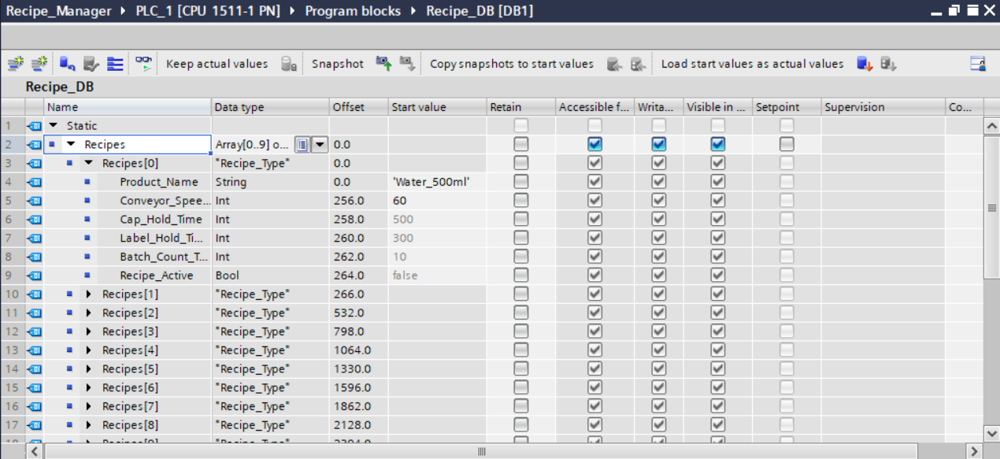

### Pre-loaded Test Recipes

| Index | Product | Speed | Cap Hold | Label Hold | Batch |
|---|---|---|---|---|---|
| 0 | Water 500ml | 60% | 500ms | 300ms | 10 |
| 1 | Juice 330ml | 45% | 400ms | 250ms | 15 |
| 2 | Oil 1L | 25% | 700ms | 400ms | 5 |
| 3–9 | Available | — | — | — | — |

---

## ⚙️ PLC Logic — SCL Structured Text

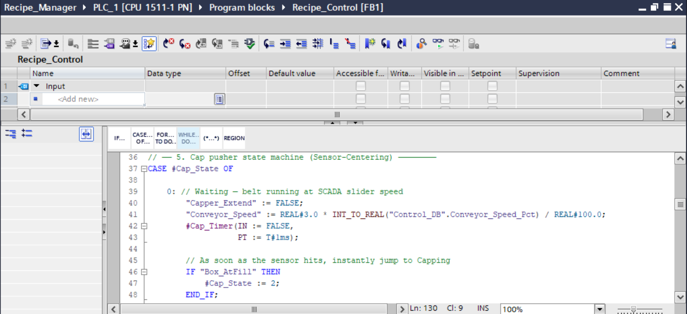

### State Machine

The `Recipe_Control` FB manages both processing stations using identical 5-state machines:

```
State 0: IDLE — waiting for sensor detection
    ↓ box detected at sensor
State 1: CENTERING — belt keeps moving, 800ms delay to center box
    ↓ timer expires
State 2: PROCESSING — belt stops, pusher extends, holds for recipe time
    ↓ timer expires
State 3: RETRACTING — pusher retracts, belt still stopped
    ↓ timer expires
State 4: CLEARING — belt resumes, waits for sensor to clear
    ↓ sensor clears
State 0: IDLE — ready for next box
```

### Recipe Activation Flow

```
Ignition writes HR1 (Active_Recipe_Index)
    → MB_SERVER receives write → updates Control_DB
    → OB1 detects index change
    → MOVE block copies Recipe_DB[index] parameters to Control_DB buffer
    → Recipe_Control FB reads new speed/times on next scan
    → Belt speed changes immediately, new timers apply to next box
```

---

## 📡 Modbus Configuration

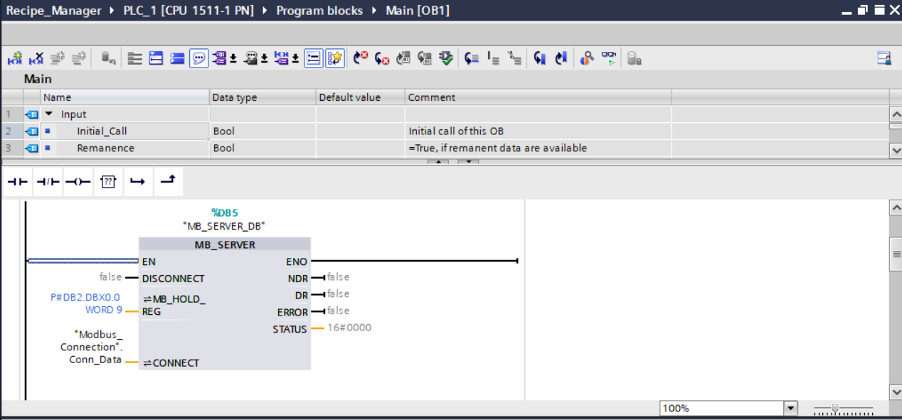

### MB_SERVER Setup in TIA Portal

```pascal
MB_SERVER(
    DISCONNECT    := FALSE,
    MB_HOLD_REG   := P#DB2.DBX0.0 WORD 20,
    NDR           => MB_NDR,
    DR            => MB_DR,
    ERROR         => MB_ERROR,
    STATUS        => MB_STATUS,
    CONNECT       := "Modbus_Connection"
);
```

### Modbus Register Map

| Register | Tag Name | Type | Access | Description |
|---|---|---|---|---|
| HR1 | Active_Recipe_Index | Int | R/W | Selected recipe (0-9) |
| HR2 | Conveyor_Speed_Pct | Int | R/W | Belt speed setpoint % |
| HR3 | Drive_Enable | Bool | R/W | Belt enable/disable |
| HR4 | Actual_Speed_Pct | Int | R | Actual belt speed readback |
| HR5 | Product_Count | Int | R | Products counted this batch |
| HR6 | Line_Running | Bool | R/W | Master line start/stop |
| HR7 | Active_Cap_Time | Int | R | Current cap hold time (ms) |
| HR8 | Active_Label_Time | Int | R | Current label hold time (ms) |
| HR9 | Active_Batch_Target | Int | R | Current batch target |

---

## 🔌 Ignition Connection

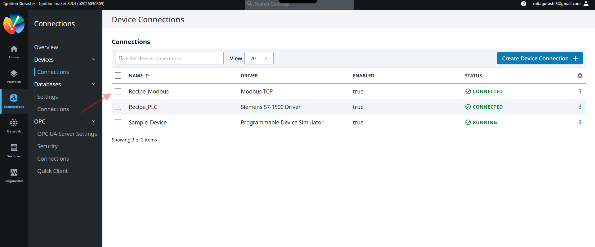

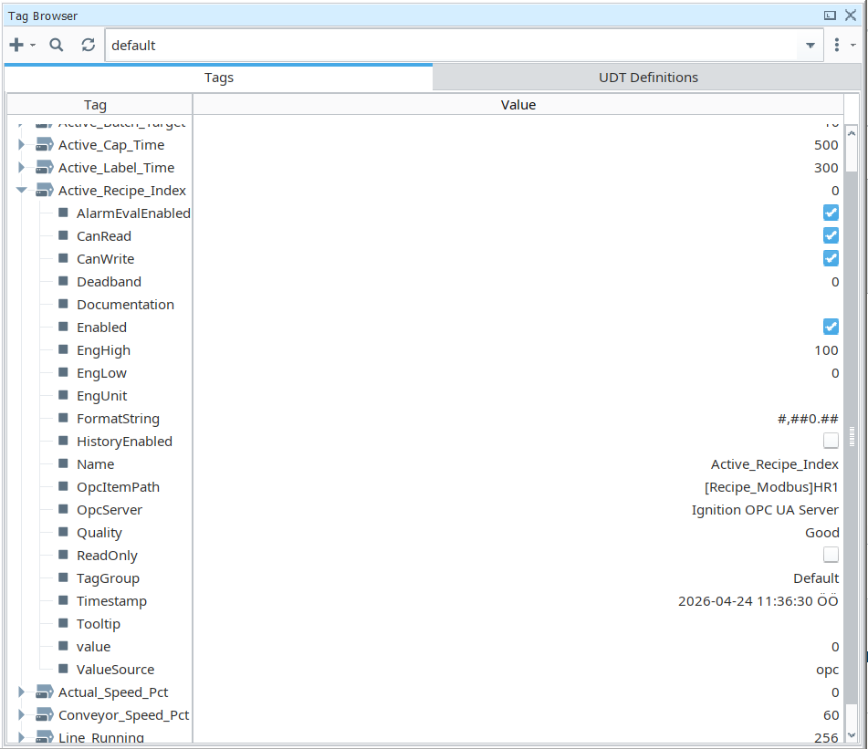

### Ignition Modbus Device Settings

```
Device Type: Modbus TCP
Hostname: 192.168.0.1
Port: 502
Unit ID: 1
```

---

## 🖥️ Dashboard Features

| Component | Function | Tag |
|---|---|---|
| Recipe Dropdown | Select active recipe (0-9) | HR1 R/W |
| Activate Button | Writes index to PLC | HR1 write |
| Start/Stop Line | Master line control | HR6 R/W |
| Speed Slider | Live conveyor speed control | HR2 R/W |
| Product Name Display | Expression-based case statement | HR1 read |
| Cap Hold Time | Live readback from PLC | HR7 read |
| Label Hold Time | Live readback from PLC | HR8 read |
| Product Counter | Live count this batch | HR5 read |
| Batch Target | Target from active recipe | HR9 read |
| Actual Speed | Speed readback | HR4 read |

---

## 🚀 Setup & Run

### Prerequisites

- TIA Portal V18 + PLCSIM Advanced V7
- Factory I/O 2.5.8
- Ignition Maker Edition 8.3.4

### Steps

**1. Start PLCSIM Advanced**
```
Open PLCSIM Advanced → Start Recipe_PLC instance → confirm RUN status
```

**2. Open TIA Portal project**
```
File → Open → RecipeManager.ap18
Online → Download to device → select PLCSIM Virtual Ethernet Adapter
Confirm PLC goes to RUN
```

**3. Start Factory I/O**
```
File → Open → Recipe_Line.factoryio
File → Drivers → Siemens S7-PLCSIM Advanced → Connect
Press Play (▶)
```

**4. Start Ignition**
```
Open browser → http://localhost:8088
Connections → Devices → Recipe_Modbus → confirm Connected
Launch Designer → open Recipe_Manager project
```

**5. Open dashboard**
```
In Designer → Preview mode → Recipe_Dashboard view
```

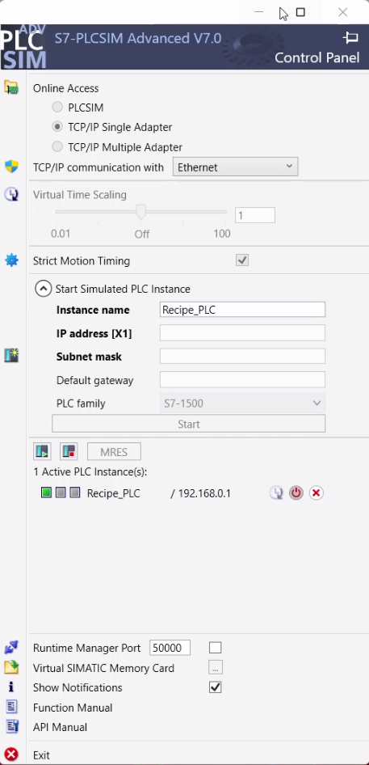

---

## 🎯 Key Design Decisions

**Why UDT array instead of flat variables?**
Storing 10 recipes as `Array[0..9] of Recipe_Type` allows the PLC to switch recipes with a single integer write from Ignition. One register changes everything.

**Why non-optimized DB access?**
Required for Modbus TCP absolute byte addressing. Optimized blocks use internal Siemens addressing that third-party protocols cannot resolve.

**Why SCL for the FB?**
State machine logic with timers is far cleaner in Structured Text than Ladder or FBD. The 5-state machine for each pusher is readable, maintainable, and easy to extend.

**Why Modbus TCP instead of OPC-UA?**
TIA Portal V18 has a confirmed bug (Siemens support thread #317080) causing crashes when compiling OPC-UA server interfaces on certain Windows configurations. Modbus TCP via the built-in MB_SERVER instruction provides equivalent bidirectional tag access and is widely used in real industrial deployments.

**Why buffer variables in Control_DB?**
Modbus cannot address nested UDT arrays with variable offsets in a single transaction. Copying recipe parameters into flat Int variables on index change makes Ignition tag addressing simple and reliable.

---

## 📊 Project Stats

- **Total development time:** ~25 days
- **Lines of SCL code:** ~150
- **Modbus registers:** 9
- **Recipe slots:** 10 (3 pre-filled)
- **Factory I/O components:** 7
- **Ignition Perspective components:** 12+

---

## 👨‍💻 Author

**Mohamed Gorashi**
MSc Automation Engineering — Erasmus+ at Politehnica University of Bucharest

[](https://www.linkedin.com/in/mohamed-gorashi-4aa3a9197/)
[](https://github.com/mitagorashi)

---

## 📄 License

This project is for portfolio and educational purposes. Feel free to reference the architecture and code patterns.
